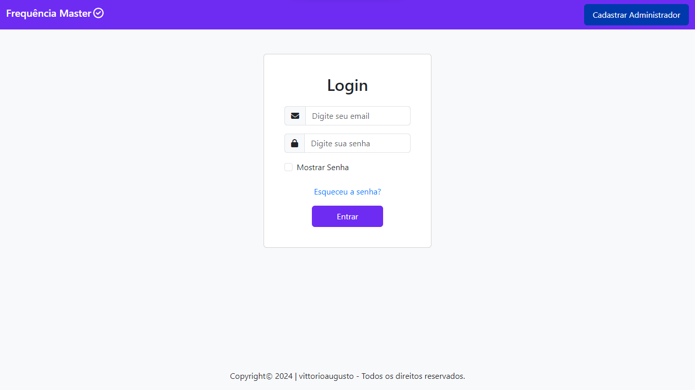
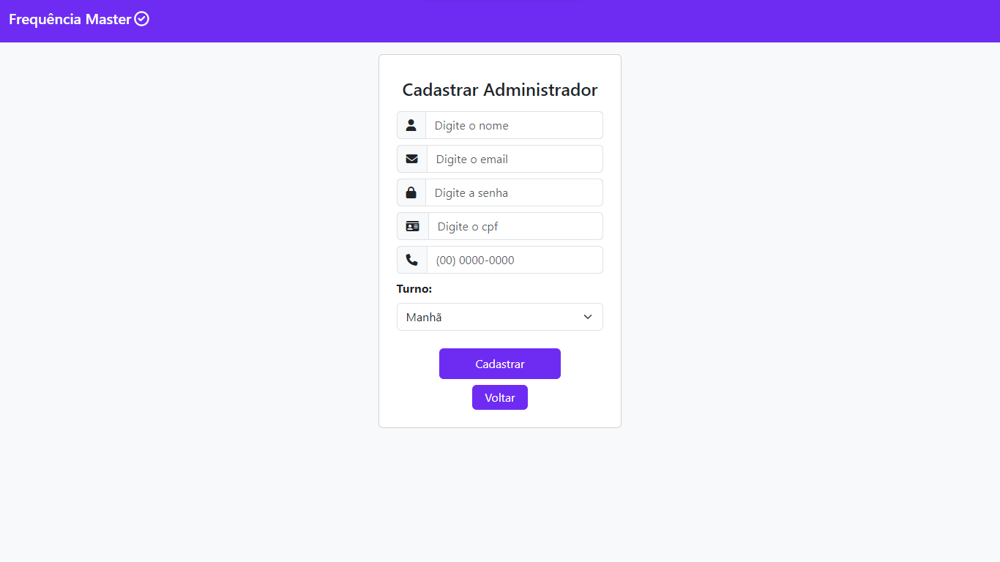
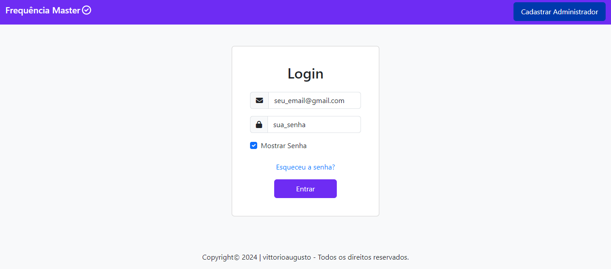

# Simulador de Controle de Frequência

Bem-vindo ao Simulador Frequência Master

## Conteúdo

- [Visão Geral](#visão-geral)
- [Instruções de Uso](#instruções-de-uso)
- [Tecnologias Utilizadas](#tecnologias-utilizadas)
- [Autor](#autor)

## Visão Geral

O simulador Frequência Master é um projeto feito por mim, com o intuito de simular a frequência de funcionários dentro de uma empresa, o administrador pode cadastrar funcionários, desativar e ativar o funcionário, ver quantos funcionários estão cadastrados, ver a frequência de cada funcionário, ver um calendário de frequência de cada funcionário e ver seu perfil. Já o Funcionário pode, realizar sua frequência, conferir qual foi o dia que realizou a frequência, ver um calendário com todas as suas frequências já realizadas

## Instruções de Uso

Para usar a página:

1. Acesse [http://localhost/controle_frequencia/index.php](http://localhost/controle_frequencia/index.php) em seu navegador.

2. Faça o Cadastro com Administrador para acessar o sistema.

3. Faça o login com o email e a senha, depois clique em "Entrar".

## Tecnologias Utilizadas

Esta página foi desenvolvida utilizando as seguintes tecnologias:

- **HTML5** 
- **CSS3** 
- **JavaScript**
- **PHP**
- **MySql**
- **Bootstrap 5**

## Autor:

 | [Vittorio Augusto](https://github.com/vittorioaugusto)
| --- | --- |

